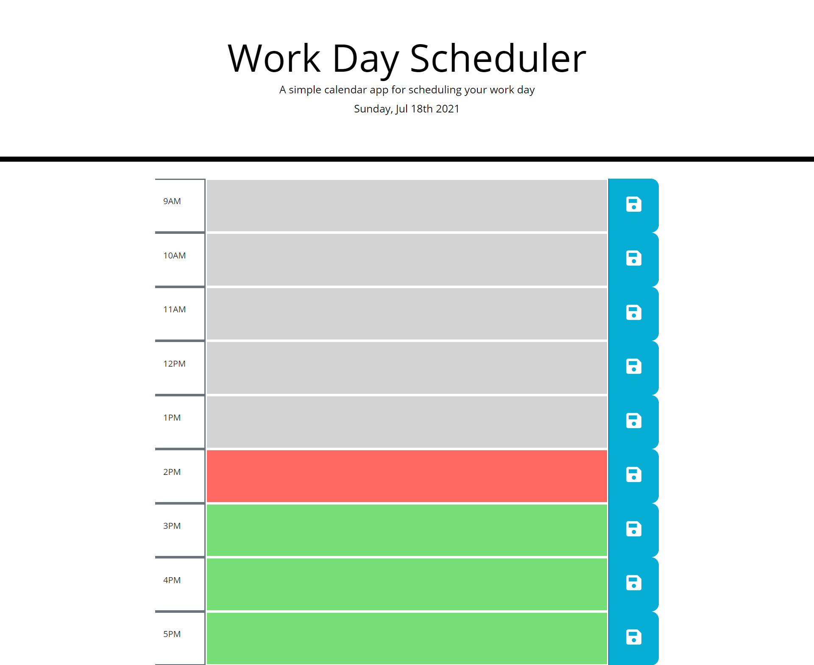

# Work Day Scheduler Starter Code

## Overview
This application is a planner for planning out events over the course of a work week. 

The grid changes colors to let you know which events have passed, what is current, and what is next. 

Clicking on an event allows you to edit the contents of the event.

The updates to your event save when you click the save button. 

## URL
Live Application:

https://zacktmiller92.github.io/work-day-scheduler/index.html

Repository: 

https://github.com/zacktmiller92/work-day-scheduler

## Application Screenshot
